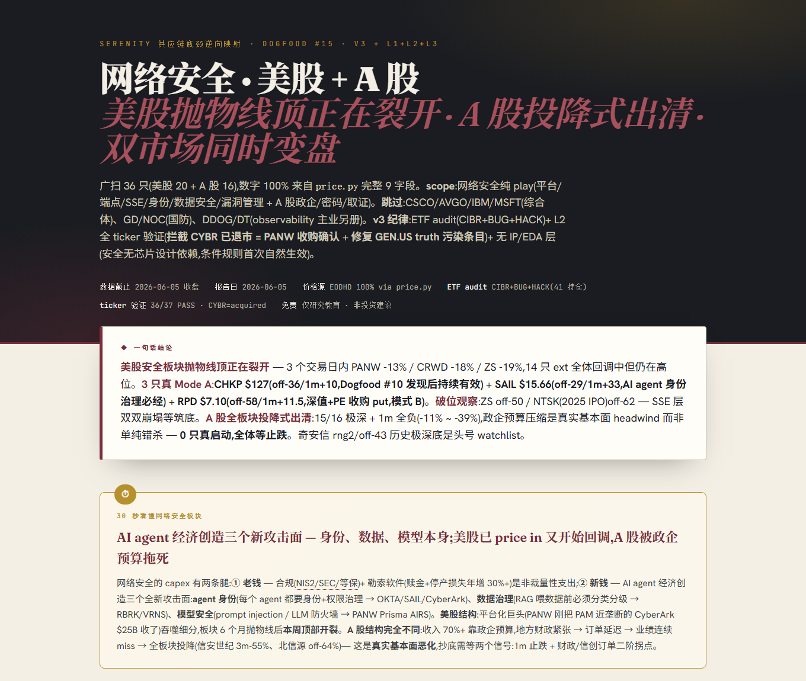

# Serenity Bottleneck Hunter — a Claude Skill

[](https://github.com/Mrjie7205/serenity-bottleneck-hunter/stargazers)
[](https://github.com/Mrjie7205/serenity-bottleneck-hunter/network/members)
[](LICENSE)
[](SKILL.md)

> Given an investment **theme**, this skill reverse-maps the supply chain to surface **overlooked upstream "bottleneck" stocks** — distilled from the *publicly shared* methodology of X/Twitter trader **Serenity (@aleabitoreddit)**.
>
> 给定一个投资主题,复用 X 博主 **Serenity** 公开分享的"供应链瓶颈逆向映射"方法,独立挖出被市场忽视的**上游瓶颈股**(而非抄他已喊过的票)。

## ⚡ 30 秒装上 / Quick start

**Claude Code(推荐)**:

```bash
# 克隆到个人 skills 目录,立即生效
git clone https://github.com/Mrjie7205/serenity-bottleneck-hunter.git ~/.claude/skills/serenity-bottleneck-hunter
```

然后在 Claude Code 里直接说:

```
用 Serenity 瓶颈猎手方法,分析「AI 数据中心电力」这个主题,给出候选标的
```

**claude.ai / Claude Desktop**:把仓库打包上传为 skill,或直接把 `SKILL.md` 拖进对话让 Claude 照着执行。

**价格数据(可选)**:`export EODHD_API_KEY=你的key`([EODHD](https://eodhd.com) 全球覆盖最广,海外股推荐);没有 key 时自动回退 yfinance(美股 OK)。**禁止用 WebSearch 猜价格** — 这是 skill 的硬纪律。

## 📊 输出长什么样 / Sample output

每个主题产出一份单文件 HTML 报告:一句话结论 → 30 秒看懂 → 产业链网状图(瓶颈节点自动判定)→ 候选 leaderboard(🟢候选/🟡观望+触发条件/🔴排除)→ 三道闸门 → 跨主题信号 → 仓位落地:



## What it does / 做什么

Theme → reverse supply-chain map → apply **9 "bottleneck archetypes"** → output a short list of overlooked upstream candidates with: thesis, archetype, valuation, entry-timing (Mode-A "buy early momentum, not the dip"), target/timeframe, and risks. The edge is being **early to the theme**, not chasing crowded names.

主题 → 逆向拆解供应链 → 套用 **9 大瓶颈原型** → 产出被忽视的上游候选 + 论点/估值/入场时机/目标价/风险。核心是**早于机构发现主题**,不追拥挤标的。

## 🛡️ 工程化纪律 / Engineering discipline

这个 skill 的差异点不只是方法论,是**把 LLM 的已知失败模式工程化拦截**(每条纪律都来自一次真实翻车,教训档案写在 `SKILL.md`):

| 防线 | 防什么 | 工具 |
|---|---|---|
| **A 穷尽性** | 凭记忆列候选会漏(漏过 PANW/CRWD 级主仓) | 已知玩家全集 audit,显式标 covered/private/acquired |
| **A+ ETF audit** | LLM 的"知名度偏见" | `scripts/theme_etf_coverage.py` 拉主题 ETF 持仓做兜底 |
| **A++ ticker 双向验证** | LLM hallucination 错位(把 603297 永新光学当成绿的谐波,价格/判定全反) | `scripts/ticker_truth.py` ground-truth 库 + `verify_tickers.py` git pre-commit hook 自动拦截 |
| **价格纪律** | 用 WebSearch/记忆猜价格 | `scripts/price.py` 强制 EODHD→yfinance,9 字段全留档 |
| **向前验证** | 事后吹回测 | `tracking/forward_picks.csv` 带日期锁定的样本外记录 |

## Use / 用法

- **As a Claude skill**: drop this folder into your skills directory (or install the `.skill` bundle), then ask Claude e.g. *"用 Serenity 的方法分析 AI 数据中心电力 这个主题,给候选标的"*.
- Or just point Claude at `SKILL.md`.
- 进阶:跨主题取交集找"被多个 capex 周期同时锁定"的标的(Serenity ⑤原型),见 `tracking/cross_theme_scan.py`。

## Structure / 结构

```
SKILL.md                         # 主流程:主题→挖股 7 步 + 两套择时 + 输出模板 + 教训档案
reference/
  methodology.md                 # 方法论(理念/筛选清单/两套择时/回避清单/风险)
  supply-chain-and-archetypes.md # 元框架 + 产业链速查表 + 9 大瓶颈原型库
  example_commercial_space.md    # 完整 worked example(商业航天)
  company_desc.md                # 公司业务描述库(带时间戳,90 天 freshness)
  ticker_truth.csv               # ticker ground-truth 库(L1,防 hallucination 错位)
  TICKER_HYGIENE.md              # L1+L2+L3 三层防御使用文档
scripts/
  price.py                       # 价格/动量(EODHD → yfinance 回退,严禁猜价)
  theme_etf_coverage.py          # ETF 持仓穷尽性 audit(A+ 防漏)
  ticker_truth.py                # ticker 验证/解析 API(L2)
  verify_tickers.py              # git pre-commit hook 扫描器(L3)
tracking/
  forward_picks.csv              # 向前(样本外)验证:带日期锁定的候选记录
  cross_theme_scan.py            # 跨主题节点矩阵(⭐ 跨 capex cycle 信号)
  score_tracker.py               # 事后拉价打分
```

## Data / 数据

- **Price & timing**: `scripts/price.py` 自动按 **EODHD(`EODHD_API_KEY`)→ yfinance** 顺序回退。EODHD 全球覆盖最广(海外股推荐);yfinance 无需 key,美股 OK 但非美股常有 gap。**WebSearch 一律不用于抓价格——猜测视为流程错误**。
- **Fundamentals & bottleneck judgment**: web research per candidate — the skill's real edge is qualitative (is it a true single-source chokepoint?), which no data feed provides.

## Validation honesty / 验证说明

The only credible test is **forward / out-of-sample**: see `tracking/forward_picks.csv` (dated, rules-locked picks) + `tracking/score_tracker.py` (re-pulls prices later and scores them). Any in-sample "backtest" suffers look-ahead & survivorship bias and is **not** a performance claim.

## ⚠️ Disclaimer / 免责声明

- **Not financial advice — educational / research use only.** / **非投资建议,仅供研究教育。**
- This project distills a **methodology** from Serenity's public posts. It does **not** redistribute his content and is **not affiliated with, sponsored by, or endorsed by** him. / 本项目只提炼其**公开方法论**,不转载其原始内容,与本人**无任何关联或背书**。
- Any "validation" inside is **logic-consistency + forward tracking**, NOT an audited performance record. Markets are risky; do your own research. / 文中"验证"为逻辑自洽 + 向前跟踪,**非经审计的业绩**。投资有风险,务必独立判断。

## License / 协议

MIT (see `LICENSE`). Methodology credit: **Serenity (@aleabitoreddit)** — this is an independent, fan-made distillation of publicly shared ideas.
